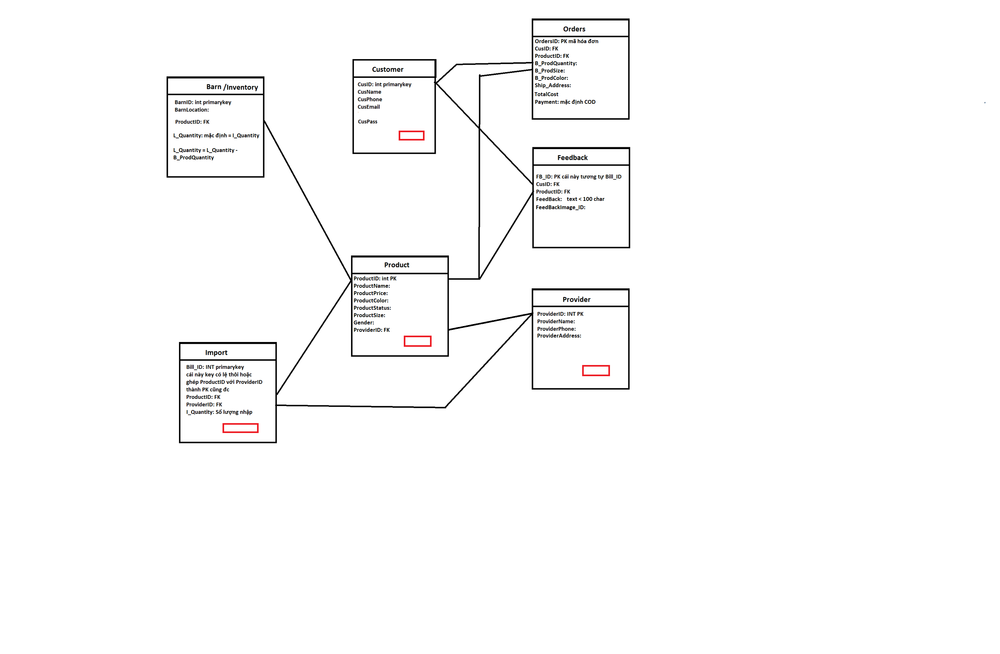

# prj301-se1714-06

PRJ301 CLASS SE1714-06

Project: Jackets Online Shop (Web bán áo khoác)  

Members:  
Đinh Gia Huy  
Nguyễn Xuân Kha  
Lại Nguyễn Minh Quân  
		  

# PRODUCT DESCRIPTION

# REQUIREMENT:  
* **Name of system:**  
|  Selling jackets online shop

* **Purpose:**  
|  The purpose of the "Selling Jackets Online Shop" project is to establish an online platform that allows us (web developers) to act as a seller, receiving products from suppliers and selling to customers, Customers can choose and buy jackets conveniently through the online form.   
|  The project aims to provide a seamless and enjoyable shopping experience for customers while meeting the following objectives:   
* **Who use this system:**  
|  The project targets young and middle-aged customers who have a youthful and dynamic fashion sense.  

* **List all feature:**  
 @ **User Registration and Authentication:**   
    |	Users should be able to create accounts and log in securely.   
    |	Implement password encryption and secure authentication mechanisms.   
    |	Provide options for users to recover forgotten passwords.     
 @ **Jacket Catalog:**  
    |	Display jackets in an organized and visually appealing manner.  
    |	Include jacket details such as title, description, price, sizes, colors, and images.
    |	Allow users to filter and sort jackets based on different criteria (e.g., price, size, gender).
    |	Implement a search functionality for users to find jackets based on keywords or specific attributes.
    |	Show more relative jackets based on brand, name, …    
 @ **Shopping Cart and Checkout:**   
    |	Enable users to add jackets to a shopping cart.  
    |	Provide options to update quantities, remove items, and calculate the total cost.   
    |	Collect and validate user shipping information during the checkout process.      
 @ **Inventory Management:**   
    |	Track jacket availability and manage stock levels.   
    |	Update inventory in real-time when jackets are added or purchased.   
    |	Implement notifications or alerts for low stock levels to ensure timely restocking.      
 @ **Customer Reviews:**   
    |	Allow customers to leave reviews by images for jackets they have purchased.   
    |	Display customer reviews on jacket detail pages.   
    |	Mobile Responsiveness:   
    |	Ensure the website is responsive and optimized for mobile devices to provide a seamless browsing experience.      
 

# 2. UI WEB TARGET DESIGN:
 

1.   Main page: 

2.  Search bar: 

3.   Jacket's Category: 

4.   Jacket's Category for Men: 

5.   Jacket's Category for Women: 

6.   ProductCard: 

7.   Sellect Size: 

8.   Gallery store: 

9.   Gallery Product: 

10.   Order: 

11.   Confirm order: 

12.   Login: 

13.   Register: 

14.   Feedback: 

# 3. DATABASE MODEL

