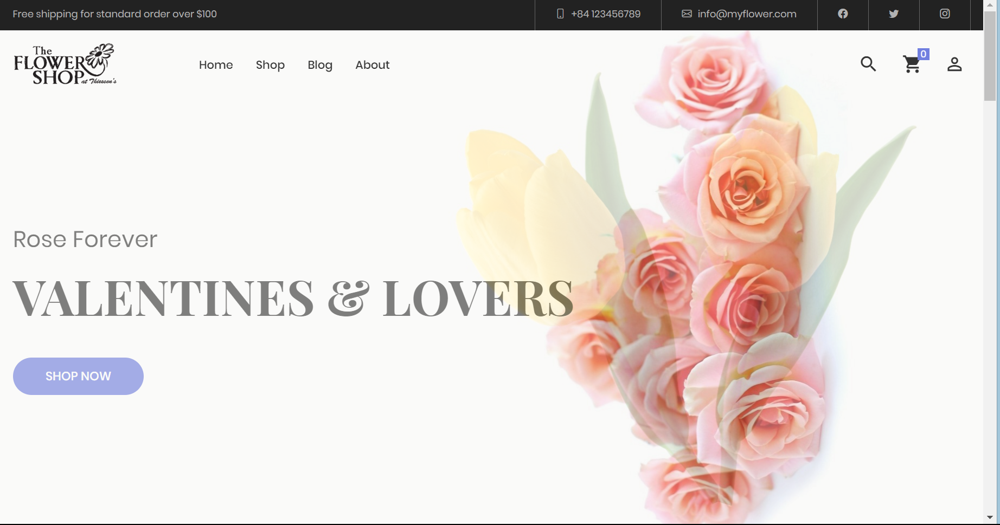
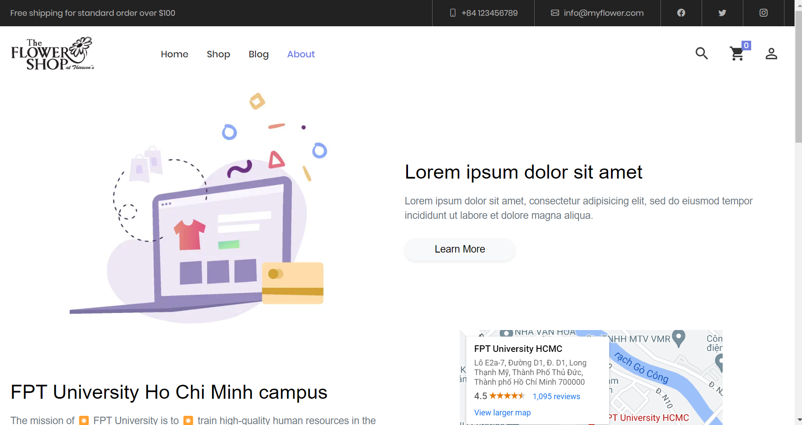
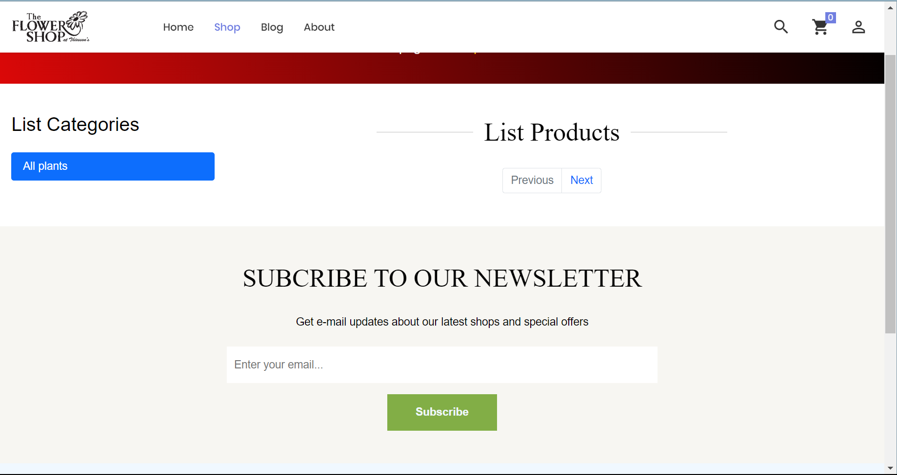
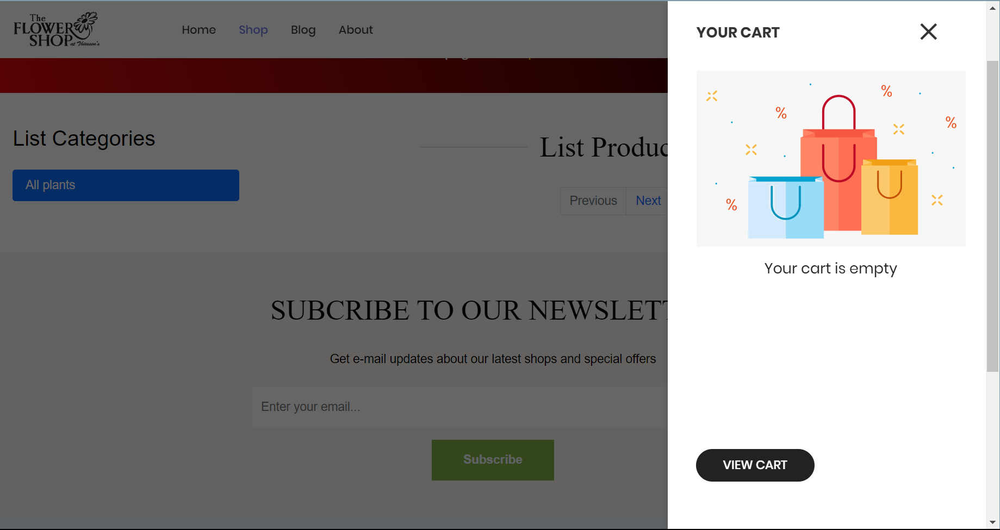
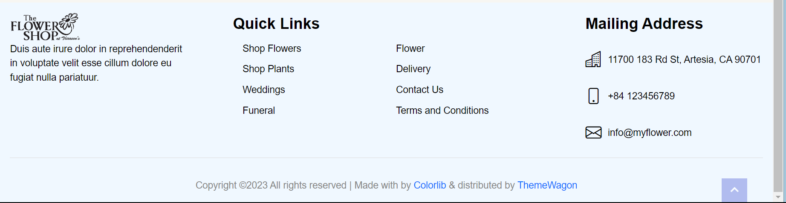

# prj301-se1714-06

Have a nice day! Everyone can check this file to know all about this project:

-PRJ301 -SE1417-06 - Assignment - Jackets Online Shop 

-----------------------------PRJ301 CLASS SE1714-06------------------------

# **Project: Jackets Online Shop (Web bán áo khoác)**
Members: 
Đinh Gia Huy 
Nguyễn Xuân Kha
Lại Nguyễn Minh Quân

# **PRODUCT DESCRIPTION**

1.	REQUIREMENT: 
a.	Name of system: Selling jackets online shop 
b.	Purpose: This project aims to provide consumers with jacket products 
c.	Who use this system: aim to adult people from 16-3x years old 
d.	List all feature: 
-See/Add/Modify/Delete information of products/ customers/ providers 
-Search/ sort product by name 
-Save/delete customer’s orders 
-Login 
-Blog 
-View gallery 

# *Admin:* 
-See/Add/Modify/Delete information of products/ customers/ providers 
-Search/ sort product by name 
-Save/delete customer’s orders into database 
-Manage customer’s account 
-Share blog 
-Export customer’s order to barn 

# *User:* 
-See information of products/ providers 
-Search/ sort product by name 
-Make orders 
-Comment 
-Login 
-View Blog 
-View gallery 

# **2. UI WEB TARGET DESIGN:** 
a.	 Main page: 

b.   Address page: 

c.   Products store: 

d.   Cart 

e.   Address bar 

